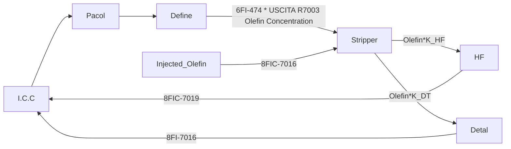
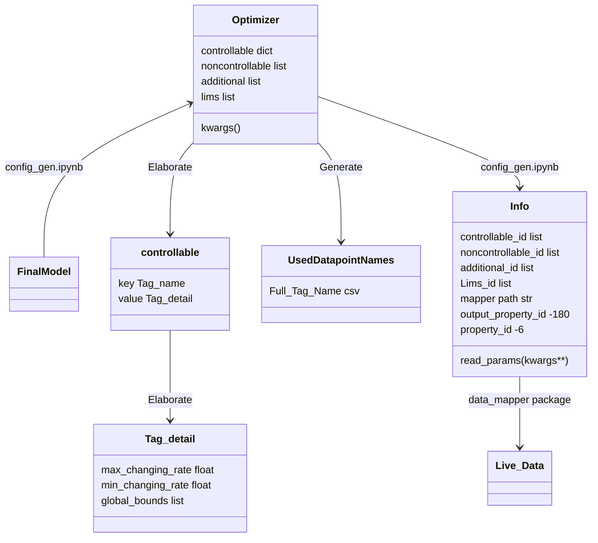
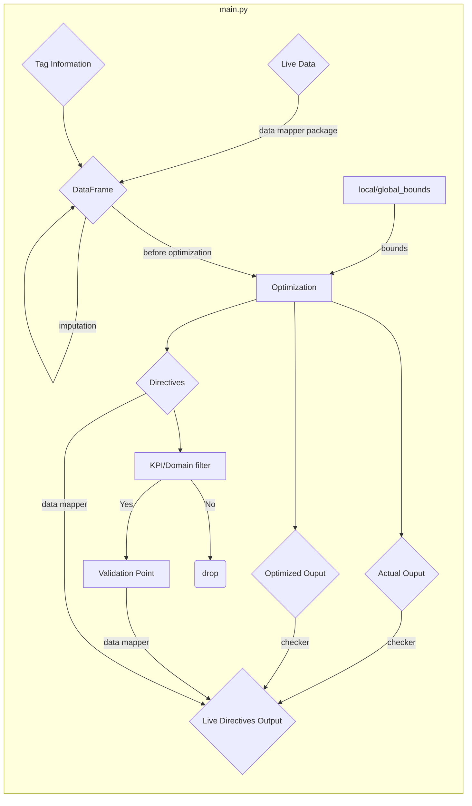

## Sasol Pacol2 Yield Optimization

#### Pacol2 Workflow



$$ Target: Max(Olefin \ Yield) $$

> Olefin Yield = 8FI-7024_B * USCITA R7003 Olefin Concentration

* Build relationship between:

	$$ Olefin = f(C_1, C_2, ..., C_n, NC_1, NC_2, ..., NC_n)$$
	* C means controllable variables
	* NC means non-controllable variables

* Optimization:
	
	* Use dual_annealing to do the optimization by tweaking the value of C.
	* By tweaking, we need a range for each C.
	* Find Global upper & lower bounds for each C from historical data.
	* If the upper & lower bounds for C vary too much, an investigation must be done. 
	*  Apply max & min changing rates for each C.
	* Min changing rates should be there because the client does not want to do minor change. 
	* Max changing rates should be there because too drastic changes cannot be achieved. 

## Data Science Workflow

#### Historical Analysis

```mermaid

graph LR

Maestro -- Tag list -- Sql Module --> DataSet{DataSet}

subgraph EDA.ipynb 

DataSet --> EDA
EDA --> FeatureEngineering(Feature Engineering)

end

subgraph Feature Selection & Baseline.ipynb

FeatureEngineering --> FeatureSelection(BorutaShap Feature Selection)
FeatureSelection <-- refined tag list --> IES((IES))
IES <-- verified tag list --> FeatureSelection
FeatureSelection -- verified tag list --Validation Strategy --> BaselineModel{BaselineModel}

end 

BaselineModel -- MLFlow -- Tuning -- Validation --> FinalModel{Final Model}

subgraph Config_gen.ipynd

FinalModel --> Config{Config}

end

```

#### Config explanation (From historical to Live)



```mermaid
class  Optimizer.json{controllable:{
									 Tag_name_A:{
									             'max_changing_rate': float,
									             'min_chaning_rate': float,
									             'global_bounds': list[float, float]
									              },... 
									 },
					   noncontrollable: list[tag_name, tag_name,...],
					   additional: list[tag_name, tag_name,...],
					   lims: list[tag_name, tag_name,...],
					   kwargs:{}
					   }

** additional is the additional tags involved in the process(KPI related, other miscellaneous).
** Lims is the Lims tags involved in the process(Concentrations).

class Info.json{
                read_params: {
			                  args:,
			                  kwargs:{sheet_name: str
			                          },
			                  }
			    mapper_path: str,
			    mapper_path_val: str,
			    output_property_id: -180,
			    property_ids: [-6],
			    controllable_id: [int, int,...],
			    noncontrollable_id: [int, int, ...],
			    additional_id: [int, int, ...],
			    Lims_id: [int, int, ...],
                }

class UsedDatapointNames.csv: all the used tags' name in the process
```
#### Live Data Explanation

Incoming live data (raw data)

|Object ID |Property ID |Value	|Timestamp	|0                  
|----------------|--------------------|---------------|------------|------------
|40293	|-6	|1.85	|1675879050000|0
|40336	|-6	|3720	|1675879050000|0
|...	|...|...	|...|0

Output live data (directives)
|Object ID |Property ID |Value	|TimeStamp	|0                  
|----------------|--------------------|---------------|------------|------------
|40424	|-180	|21.31	|1675879050000|0
|40475	|-180	|133.21	|1675879050000|0
|31300	|27	|1.012	|1675879050000|0
|...	|...|...	|...|0

> All the object/property id can be found in a spread sheet given by R&D. Should put the data into the right place. 
> When pulling\ submitting data from\to __Maestro__, these data should be in __live format__.

#### Maestro demo

1. Look at the trend of a specific tag.
2. Final Dashboard. 

#### Live Deployment



> For more details, look at repo [HF-Live](https://github.com/Elutions/hf-live) with good explanation. 


> Written with [StackEdit](https://stackedit.io/).
